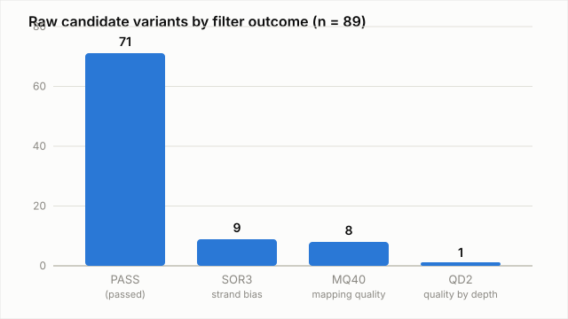
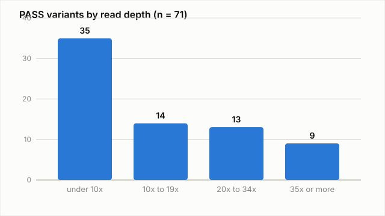

# Bioinformatics Portfolio Analytics (SQL)

A lightweight, LIMS style SQLite database and reporting layer that tracks the samples, pipeline runs, variant calls, differential expression results, and QC metrics from across this portfolio in one queryable place, and a set of core analytical queries written against it.

## Technologies used

Python 3 (standard library only: sqlite3, csv), SQL (SQLite dialect), window functions, conditional aggregation.

## Biological background

A single bioinformatics pipeline produces one kind of result: a variant call set, a differential expression table, a classifier's metrics. Once a lab or a portfolio has more than one pipeline running, the useful question becomes cross cutting: which samples fed which run, how did QC compare across runs, which pipelines are actually done. That is a sample and results tracking problem, not a biology problem, and it is normally solved with a database, not a spreadsheet. In a regulated pharma or diagnostics lab this is close to what a LIMS (laboratory information management system) does: it does not replace the pipelines, it is the layer that keeps their inputs and outputs auditable and queryable together.

## Dataset

This project does not generate new biological results. It loads real, already committed outputs from three other repos in this portfolio:

| Source | File(s) | What was pulled in |
|---|---|---|
| [rna-seq-differential-expression-pipeline](https://github.com/MohamedElsaid-bit/rna-seq-differential-expression-pipeline) (v1.0) | `config/samples.tsv`, `results/tables/deseq2_results.tsv` | 8 samples (4 donors, dex vs untreated), all 3,543 tested genes with their DESeq2 statistics |
| [variant-calling-pipeline](https://github.com/MohamedElsaid-bit/variant-calling-pipeline) (v1.0) | `results/vcf/filtered_snps.vcf.gz`, `results/vcf/filtered_indels.vcf.gz` | All 89 raw candidate variants with their real GATK FILTER outcome (not just the 71 that passed) |
| [biomedical-ml-classification](https://github.com/MohamedElsaid-bit/biomedical-ml-classification) | README test set table | Headline test metrics (accuracy, ROC/AUC) for the three classifiers |

Every number in `data/processed/*.csv` traces back to a file already committed and public in one of those repos; nothing here is simulated or invented for this project. The two planned projects (gut microbiome, multi omics capstone) are included as `Planned` rows in the `projects` table so the portfolio wide view is complete, with no runs or results attached since none exist yet.

The extraction step that produced these CSVs is not part of this repo (it reads sibling repo paths that only exist on the machine that built it); the CSVs it produced are committed here, so this repo is self contained and reproducible from a clone alone.

## Schema

```
projects (project_id, name, repo_url, status, description)
   |
   +-- pipeline_runs (run_id, project_id, pipeline_name, pipeline_version, tools, run_date, runtime_seconds, runtime_notes)
         |
         +-- run_samples (run_id, sample_id)  -- bridge table
         |         |
         |         +-- samples (sample_id, project_id, sample_name, organism, subject_or_donor, condition, source_accession, notes)
         |
         +-- variant_calls (variant_id, run_id, chrom, pos, ref, alt, qual, filter, variant_type, depth, allele_freq)
         +-- de_results   (result_id, run_id, gene_id, gene_symbol, base_mean, log2fc, pvalue, padj, significant, direction)
         +-- qc_metrics   (metric_id, run_id, metric_name, metric_value, source_note)
```

`variant_calls` and `de_results` are typed tables for the two result kinds that actually repeat across runs today. `qc_metrics` is a generic key/value fact table on purpose: a GATK run's Ti/Tv ratio, an RNA-seq run's PCA variance explained, and a classifier's ROC/AUC do not share a schema, and forcing them into one wide table would mean adding a nullable column every time a new pipeline type joins the portfolio. Full definition in [`sql/schema.sql`](sql/schema.sql).

## Workflow / methods

1. Extract real results from the source repos into flat CSVs (`data/processed/*.csv`), already committed here
2. Create the SQLite database from [`sql/schema.sql`](sql/schema.sql) and load the CSVs (`scripts/build_db.py`)
3. Run the core analytical queries in [`sql/queries/`](sql/queries) against it and write each result to `results/tables/` (`scripts/run_report.py`)

## How to run it

No external packages required, Python 3.9 or later only.

```bash
python3 scripts/build_db.py   # builds data/processed/portfolio_analytics.sqlite
python3 scripts/run_report.py # runs every query in sql/queries/, writes results/tables/*.csv
```

Expected runtime: well under a second; the database is a few thousand rows.

To explore interactively instead:

```bash
sqlite3 data/processed/portfolio_analytics.sqlite
sqlite> .read sql/queries/05_qc_metrics_pivot.sql
```

## Results and interpretation

**Portfolio status in one query.** [`01_project_overview.sql`](sql/queries/01_project_overview.sql) joins `projects` to `pipeline_runs` and shows 3 of the 5 portfolio projects as Complete with exactly one run each, and the 2 planned projects correctly showing zero runs through the `LEFT JOIN`, rather than being silently dropped.

**Variant filtering, with real filter reasons.** Loading the pre-merge SNP and indel VCFs (not just the final PASS-only file) keeps each failing variant's actual GATK filter tag, not just a PASS/fail flag.



Of 89 raw candidate variants, 71 passed (68 SNPs, 3 indels). Of the 18 filtered out, 9 failed on `SOR3` (strand bias, StrandOddsRatio), 8 on `MQ40` (mapping quality), and 1 on `QD2` (quality normalized by depth). This matches, and gives the precise breakdown behind, the variant-calling-pipeline README's summary that filtering mostly removed strand bias and mapping quality outliers.

**Read depth of the variants that passed.** The variant-calling README flagged that PASS variants sit mostly at low to moderate depth and that depth based filtering was out of scope for that project. Querying `variant_calls` directly shows exactly how skewed that is:



49 of 71 PASS variants (69%) sit under 20x depth; only 9 are at 35x or more. That is a quantified version of a claim the source README only made qualitatively.

**Differential expression, cross checked.** [`04_de_direction_summary.sql`](sql/queries/04_de_direction_summary.sql) reproduces the RNA-seq README's headline numbers independently from the raw DESeq2 table: 3,543 genes tested, 108 significant (padj < 0.05 and |log2FC| > 1), split 61 up and 47 down. [`03_top_upregulated_genes.sql`](sql/queries/03_top_upregulated_genes.sql) ranks the strongest upregulated hits by fold change; FKBP5, GPX3, PER1 and DUSP1 (the genes the RNA-seq README calls out by name) all land in the top 10, alongside a few higher fold change genes (ALOX15B, ADRA1B, MARCHF10, C7, and two rows without a resolved gene symbol) that README did not individually discuss.

**Cross pipeline comparison in one row per run.** [`05_qc_metrics_pivot.sql`](sql/queries/05_qc_metrics_pivot.sql) uses `CASE` inside `MAX()` to pivot the long `qc_metrics` table so one row shows a DE gene count next to a Ti/Tv ratio next to a model's test accuracy, three unrelated metric types from three unrelated pipeline kinds, side by side. SQLite has no native `PIVOT`, so conditional aggregation is the standard way to get this shape.

**Honesty check on the runtime query.** [`07_runtime_ranking.sql`](sql/queries/07_runtime_ranking.sql) ranks runs by wall clock time using `RANK() OVER (...)`. Today it returns exactly one row, because only the variant calling pipeline's README reports a precise measured runtime (3 minutes 34 seconds); the RNA-seq README only gives a 30 to 40 minute range, and the ML project's runtime was never recorded. The query filters on `runtime_seconds IS NOT NULL` rather than coercing the range into a fake point estimate.

## Limitations

- Three real pipeline runs is a small dataset for a database project; several queries (runtime ranking, cross pipeline pivot) will get more interesting as Projects 4 and 5 add runs
- The ETL from source repo to CSV was a one time manual pull, not an automated sync; if the source repos' committed results change, these CSVs have to be regenerated by hand
- No concurrent write access or transactions are exercised since this is a read mostly reporting database, not an operational one
- SQLite was chosen for zero install reproducibility; a true multi user LIMS would need a client/server database with role based access

## Future improvements

- Re-run the extraction step when Project 4 (gut microbiome) and Project 5 (multi omics capstone) produce real results, and add their runs, samples, and metrics
- Add a small `CHECK` or trigger layer enforcing that a run's `project_id` matches its samples' `project_id`
- Port the schema to PostgreSQL to demonstrate indexes, `EXPLAIN ANALYZE`, and role based access control on the same data
- Add a thin CLI (`argparse`) over `run_report.py` so a single named query can be run and exported without re-running the whole report

## Contact / links

GitHub: [MohamedElsaid-bit](https://github.com/MohamedElsaid-bit)
Portfolio: [mohamedelsaid-bit.github.io/Portfolio-](https://mohamedelsaid-bit.github.io/Portfolio-/)
